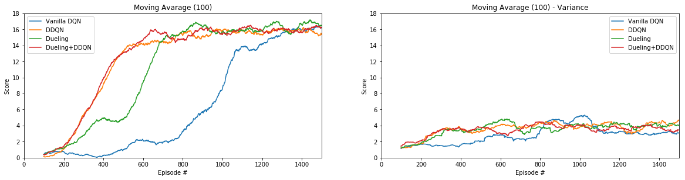

# Deep Reinforcement Learning Project #1 - Report
Here below are reported the main characteristics of the Reinforcement Learning algorithm used to solve the DRLND <em>Navigation</em> environment.

## Learning Algorithm
The used algorithm is the Deep Q-Network (DQN). I started from the implementation of the algorithm provided by Udacity in its DRLND.

The `dqn` function in `my_methods.py` runs the selected number of episodes. Along each episode the agent performs a serie of actions `action = agent.act(state, eps)` on the environment and the results (`next_state` and `reward`) are collected with the `action` taken and the actual `state` in the reply buffer (`class ReplayBuffer`) of the agent.
The actions are generated by the Deep Neural Network (DNN) model in `model.py` and some degree of randomness is included to ensure exploration for the training purpose. The randomness is managed by the parameter `eps` which decay during the training to reduce this feature along the training.

At each step, if the number of agent's experiances collected in the replay buffer is bit enough, the agent randomly retrieves the SARS (state, action, reward, next state) tuples from the replay buffer and update the DNN model to maximize the rewards (`Agent.learn` function). A target DNN is used beside a soft-update strategy (`Agent.soft_update`). This configuration is an important feature of the DWN algorithm that improve the stability of the learning process.

When an avarage score over 100 episodes higher than 13 is achieved an any improvement of the avarage score from this point is done, the DNN model is saved.

More details about DQN can be found in this [pdf](https://storage.googleapis.com/deepmind-media/dqn/DQNNaturePaper.pdf).

### Improvements
Few variations of the DQN implementation are included in the agent. They can be managed with the `rainbow` dictionary, which includes:
- `'DDQN'` (Double Deep Q-Learning)[https://arxiv.org/abs/1509.06461]: decoupling the evaluation of the Q function for the action taken just by using the target network.
- `'Dueling'` (Dueling networks)[https://arxiv.org/abs/1511.06581]: the `Dual_DQN` model is used in place of the standard `DQN` in `model.py`. Here the DNN is splitted in two parts, one in charge of the state-value estimation and the other calculating the advantages for each action. 

## Model and Parameters
The file `model.py' holds the classes of the Neural Network for the generic DQN and the Dueling DQN.

Here a summary of parameters used:

`lrate_critic=1e-3,
lrate_actor=1e-4,
tau=0.01,
gamma=0.99,`

Replay Buffer
`BUFFER_SIZE` = 10000,
`BATCH_SIZE` = 64

Ornstein-Uhlenbeck noise
`exploration_mu=0.0,
exploration_theta=0.25,
exploration_sigma=0.30,
noise_decay=0.99995`

## Results

The trend below shows the score avarege on 100 episode achieved by the agent across the learning process.
The trend compares the DQN Vanilla with the improved methods implemented. a second trend shows the variance of the results. 

All the methods overcome the target of average reward (over 100 episodes) of +13 and they stabilize around +16. This limit is due to the duration of the episode and the variability of the result is related to the stocastic distruburion of the bananas and the residual noise necessary to commit to exploration during training.

Running the trained model, the agent achieves easly 20 points in one single episode. 

## ToDo list
Much more stuff can be done to around the project.

### Training Algorithm improvements
This Deep Q-Learning algorithm can be still improved with proved extensions.
Here the planned implementations:
1.Prioritized replay
2.Distributional DQN

### Deep Analysis of the Paramenters and Architecture
Wide analysis of the impact of the training parameters and model architecture on the training performance. A specific Jupyter Notebook will be set up for the purpose.

### Improve Exploration Strategy
The exploration of the environment for part of the agent is an important aspect of the training, particulatly when the environment is not stable. The randomness of the action taken to promote exploration can be improved with more sofisticated strategies taking into account the learning process. A more complex environment may be needed for testing.

### Step to Pixel Based State Space
Use the *Navigation_Pixels.ipynb* and adapt the agent code to solve the banana collection enviroment using raw pixels. That will require mainly the modification of the `model.py` to include convolutional layers.
